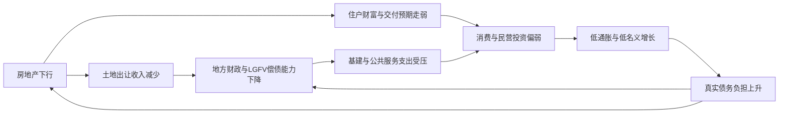

---
{
  "id": "中国经济模式-主要挑战与政策前景",
  "title": "中国经济模式、主要挑战与政策前景",
  "date": "2026-05-12",
  "category": "daily",
  "tag": "中国经济，宏观经济，政策",
  "tags": [
    "中国经济",
    "宏观经济",
    "政策"
  ],
  "image": "assets/uploads/中国经济模式-主要挑战与政策前景-cover-1778570655996-2ab85530.png",
  "layout": "essay",
  "pinned": false,
  "sortOrder": 1778572462115,
  "excerpt": "中国经济已从“地产—基建—地方融资”主循环，转入“政策托底—制造升级—出口补位”阶段。短期更可能守住增速与金融底线，但内需不足、债务累积与外部摩擦仍会压低中期增长中枢。"
}
---
中国经济已从“地产—基建—地方融资”主循环，转入“政策托底—制造升级—出口补位”阶段。短期内更可能守住增速与金融底线，但若财政资源不更多转向居民、社保和服务业，内需不足、债务累积与外部摩擦会继续压低中期增长中枢。[1]

## 经济模式现状

当前的中国[2]经济模式，既不是典型的消费驱动型，也不再是单纯的房地产驱动型，而是更接近“国家主导的投资—产业政策—银行信贷—出口补位”组合：一方面，制造业升级、高技术产业与基础设施仍由政策性资源和银行体系广泛支撑；另一方面，房地产下行后，净出口和高端制造承担了更大的增长补位功能，而居民消费和服务业虽然比重上升，但仍未成为足够强的单一主引擎。国际货币基金组织[3]在 2025 年第四条磋商中明确指出，中国面临的核心问题是：房地产长期调整、地方财政承压、国内需求偏弱、对出口依赖上升，以及“国家主导、债务融资投资”带来的生产率下降与金融脆弱性。[4]

| 年份 | GDP增速 | 最终消费拉动GDP | 资本形成拉动GDP | 净出口拉动GDP | 城镇化率 | 城镇调查失业率 |
| --- | --- | --- | --- | --- | --- | --- |
| 2021 | 8.1% | 5.3个百分点 | 1.1个百分点 | 1.7个百分点 | 64.7% | 5.1% |
| 2022 | 3.0% | 1.0个百分点 | 1.5个百分点 | 0.5个百分点 | 65.2% | 5.6% |
| 2023 | 5.2% | 4.3个百分点 | 1.5个百分点 | -0.6个百分点 | 66.2% | 5.2% |
| 2024 | 5.0% | 2.2个百分点 | 1.3个百分点 | 1.5个百分点 | 67.0% | 5.1% |
| 2025 | 5.0% | 2.6个百分点 | 0.8个百分点 | 1.6个百分点 | 67.9% | 5.2% |

表中增长、三大需求拉动、城镇化率和失业率均来自国家统计局[5]年度统计公报。2025 年的数据表明，在实现 5.0% 增速的同时，增长对净出口和最终消费的依赖都高于资本形成，这说明“投资一枝独秀”的旧模式已弱化，但“消费独立接棒”的新模式仍未形成。[6]

| 年份 | 私人消费占GDP | 资本形成占GDP | 货物出口占GDP估算 | 居民储蓄率估算 | 债务/GDP | 房地产开发投资占GDP估算 |
| --- | --- | --- | --- | --- | --- | --- |
| 2021 | 38.4% | 42.7% | 19.0% | 31.4% | 265% | 12.9% |
| 2022 | 37.8% | 42.4% | 19.8% | 33.5% | 276% | 11.0% |
| 2023 | 39.6% | 41.1% | 18.9% | 31.7% | 288% | 8.8% |
| 2024 | 39.9% | 40.6% | 18.9% | 31.7% | 299% | 7.4% |
| 2025 | 40.1% | 38.8% | 19.3% | 32.0% | 313% | 5.9% |

表中私人消费占GDP、资本形成占GDP和债务/GDP采用国际货币基金组织[3]口径；“货物出口占GDP”与“房地产开发投资占GDP”为按国家统计局[5]公布的货物出口额、房地产开发投资和GDP直接估算；“居民储蓄率”为按全国居民人均可支配收入减人均消费支出再除以人均可支配收入估算，属于说明性估算，不是官方公布指标。这个表最重要的结论是：消费占比虽有抬升，但仍偏低；资本形成依然偏高；居民储蓄倾向长期较强；而总债务率持续上升，意味着旧增长机制并未真正退出。[7]

从产业结构看，2025 年第一、第二、第三产业占GDP比重分别为 6.7%、35.6% 和 57.7%；服务业已是最大部门，但第二产业比重仍显著高于多数成熟经济体。值得注意的是，制造业内部正在明显升级：2025 年规模以上装备制造业增加值增长 9.2%，占规模以上工业增加值比重升至 36.8%；高技术制造业增长 9.4%，占比升至 17.1%；数字产品制造业占比 12.5%；工业机器人、集成电路、新能源汽车产量分别增长 28.0%、10.9% 和 25.1%。这说明“工业升级”是真实存在的，但它尚未自动转化为居民收入占比与消费占比的同步上升。[8]

从区域结构看，东部仍是绝对主引擎。2025 年东部地区GDP为 730876 亿元，中部 299108 亿元，西部 298750 亿元，东北仅 65035 亿元；按 2023 年居民人均可支配收入看，东部为 49822 元，中部 33328 元，西部 31100 元，东北 33207 元。也就是说，中国的真实问题不是“全国平均增长多少”，而是东部产业升级、沿海出口和都市圈服务业升级较快，中西部受基建和产业转移带动但财政基础较弱，东北则长期受人口流出、产业老化和投资回报偏低掣肘。[9]

金融结构仍然是银行主导型。中国人民银行[10]在《中国金融稳定报告（2024）》中强调，金融体系总体稳健，并将房地产、融资平台债务、中小金融机构风险和外汇市场韧性列为重点工作。与此同时，IMF 的表格显示，影子银行资产占GDP已由 2021 年的 15.5% 降至 2025 年的约 12.2%，表面上是收缩的；但IMF同时指出，展期、非透明资产处置和隐性担保可能掩盖真实损失，说明中国金融风险的形式已经从“明面上的高波动”转向“表面稳定下的慢性累积”。[11]

地方政府融资平台并没有随着影子银行收缩而消失，而是更深地嵌入地方财政与准财政体系。IMF 估计，2025 年地方融资平台债务约为GDP的 48%，广义政府债务（含政府引导基金和地方融资平台）约为GDP的 154%；而财政部[12]和全国人民代表大会常务委员会[13]披露的化债安排，是 2024—2026 年新增 6 万亿元地方政府债务限额置换存量隐性债务，并通过专项债安排等方式，把 2028 年前需化解的隐性债务规模压降到 2.3 万亿元。这里的关键不是数字孰高孰低，而是：官方和IMF的债务口径差异本身，就说明地方杠杆与准财政活动仍具有较高不透明性。[14]

房地产在GDP中的“狭义比重”已明显下降，但在金融稳定中的“广义权重”仍然极大。2024 年房地产业增加值占GDP比重为 6.3%；按 2025 年行业增加值与GDP测算，房地产业约占 5.9%，若连同建筑业合并则约占 12.1%。与此同时，房地产开发投资占GDP比重已从 2021 年的约 12.9% 持续降到 2025 年的约 5.9%，70 个大中城市房价在 2025 年底仍呈普遍弱势，12 月二手房价格环比下降城市为 70 个。换言之，房地产已不再是高增长发动机，但仍是银行资产、地方土地财政、住户财富预期和企业现金流的共同枢纽，因此它的“增长贡献”下降，不等于它的“系统重要性”下降。[15]

## 结构性挑战

真正的约束，不是单一指标偏弱，而是多个约束同时存在：人口老化压低潜在增长，房地产拖累地方财政，债务高企抬升政策成本，外部摩擦削弱出口可持续性，而消费不足又使所有问题更难被名义增长“稀释”。[16]

| 挑战 | 规模与现状 | 主要传导路径 | 时间窗口 | 不确定性与依据 |
| --- | --- | --- | --- | --- |
| 人口老龄化与低生育 | 2025 年出生人口 792 万，65 岁及以上占比 15.9%；联合国口径 2025 年总和生育率约 1.0。 | 劳动力供给下降、养老金和医疗支出上升、居民预防性储蓄提高、消费结构老化。 | 中长期，2026—2035 年最明显。 | 不确定性较低；政策能改善边际趋势，但很难逆转总趋势。[17] |
| 债务与金融风险 | IMF 估计 2025 年总债务约 GDP 的 313%，LGFV 债务约 48%，影子银行约 12% 左右；官方继续推进隐性债务置换。 | 名义增长偏低会抬高真实债务负担，压缩地方支出空间，并通过银行、AMC、城投链条向金融体系传导。 | 短中期，未来 1—5 年。 | 不确定性中高；最大不确定来自广义口径、隐性担保与资产质量识别。[18] |
| 房地产调整与去杠杆 | 房地产开发投资/GDP 五年内由约 12.9% 降至 5.9%；2025 年底二手房价格环比下跌城市为 70 个。 | 土地出让收入下降→地方财政收缩；房价和交付预期走弱→居民财富效应变差；开发商现金流恶化→银行与上下游链条承压。 | 立即到中期，1—3 年最关键。 | 不确定性中等；核心在于库存去化速度、保交付质量和中央财政是否更强介入。[19] |
| 外需、供应链与科技约束 | 2025 年净出口拉动 GDP 1.6 个百分点；IMF判断对出口的依赖更难持续，BIS 仍对中国先进半导体出口实行许可管制。 | 出口受阻会同时打击制造业利润、就业和地方税源；高端芯片与设备受限会延缓部分产业升级。 | 立即到中期，取决于贸易摩擦演变。 | 不确定性高；外部政策具有明显政治性和突发性。[20] |
| 消费不足、收入分配与社会稳定 | 2025 年CPI为 0，居民储蓄率估算仍约 32%；政府工作报告承认“群众就业和增收难度加大”。IMF 的再平衡记分卡显示基尼系数虽改善但仍约 0.459。 | 低通胀与弱收入预期→居民更倾向储蓄；消费不足→企业投资回报下降；青年就业与中低收入群体承压→社会心理脆弱。 | 立即到中期。 | 不确定性中等；关键看社保扩张和就业修复能否改变预期。[21] |
| 环境与资源约束 | 2025 年每万元GDP二氧化碳排放下降 5.0%，非化石能源消费占比 21.7%；但国务院仍要求对高耗能项目实施更严格约束。 | 高耗能行业扩产会与碳约束、能耗约束和外部绿色壁垒碰撞，抬高产业转型成本。 | 中长期，但对部分行业已是当期约束。 | 不确定性中等；技术进步能缓解约束，但不能消除约束。[22] |

综合看，最危险的不是“某个挑战特别大”，而是挑战之间互相放大：地产弱导致地方财政弱，地方财政弱导致社保和公共服务扩张受限，社保不足又强化居民储蓄偏好，消费偏弱再迫使增长依赖出口和投资，而出口和投资越强又越容易触发外部摩擦与产能过剩争议。[23]

## 风险传导机制

下图概括了目前最核心的“房地产—地方财政—内需—债务”传导链。这个链条之所以难解，在于它不是一次性冲击，而是会在低通胀、弱信心和财政约束下形成自我强化。[24]

IMF 的判断是，房地产持续收缩叠加高债务，可能导致国内需求进一步走弱、通缩压力固化，并迫使经济继续更多依赖出口。中国人民银行[10]则在金融稳定报告中把房地产、融资平台和中小金融机构放在同一个风险处置框架内，说明官方也知道这些问题并不是相互独立的。[25]

## 可行出路

可行出路不是“再来一轮强刺激”，也不是“硬着陆式去杠杆”，而是把短期稳增长、中期化债、长期再平衡三件事同时推进，其中最关键的一步是把财政和金融资源的边际投向，从“保投资和保主体”逐步转到“保居民收入、保消费能力、保服务供给”。这也是IMF反复强调的方向。[26]

| 政策工具 | 短中长期效果 | 实施难度 | 主要副作用 | 配套要求 |
| --- | --- | --- | --- | --- |
| 更积极的中央财政，直接投向育儿、养老、医疗、低收入家庭和消费补贴 | 短期能托底需求；中期能降低预防性储蓄；长期有助于把增长转向消费主导 | 中等 | 赤字上升、中央财政压力增大 | 必须由中央财政主导，不能再主要压给地方 |
| 适度宽松货币政策与结构性工具 | 短期稳流动性、降融资成本；中期缓解债务滚续压力 | 低到中等 | 若需求端不修复，易形成“宽货币、弱信用” | 需与财政和资产出清同步推进 |
| 地方化债与财政体制改革捆绑 | 中期最重要；能减少平台挤占、恢复公共支出能力 | 高 | 短期暴露隐性亏损，可能冲击地方政绩与融资惯性 | 需推进央地事权财权再分配、提高透明度 |
| 房地产“保交付+去库存+保障房转换+开发商出清” | 短期稳预期；中期降低系统性风险；长期使行业回归居住属性 | 高 | 若只稳楼市不出清，会延长僵尸化；若只出清不托底，会放大下行 | 需中央财政、政策性银行和地方执行协同 |
| 社保扩张、户籍改革与公共服务均等化 | 中期改善消费倾向和劳动力流动；长期提升生产率 | 高 | 财政成本较高，触及既得利益 | 需与人口政策、城市化政策统筹 |
| 产业政策从“扩产量”转向“提回报和原创能力” | 中长期提升全要素生产率 | 中等 | 短期可能放缓部分行业投资和地方招商 | 需硬约束“内卷式竞争”、强化知识产权和基础研究 |
| 对外开放与汇率政策保持稳定、推进市场多元化 | 短期稳外贸；中期缓解单一市场风险 | 中等 | 过度依赖出口多元化仍不能替代内需修复 | 需避免把汇率作为主要刺激工具 |

上表的判断，综合了国际货币基金组织[3]对“投资于人、促进消费、加快地产出清、进一步宽松货币”的建议，以及国务院[27]和政府工作报告已经公开采用的工具顺序。一个重要结论是：货币宽松和房地产托底都只是条件，不是答案；答案只能是财政结构调整与社会保障扩张。[28]

| 政策路径 | 目标 | 主要措施 | 预期效果 | 主要风险 |
| --- | --- | --- | --- | --- |
| 稳增长优先 | 尽快把增长稳定在 4.5%—5% 左右 | 加大赤字、专项债、设备更新、消费品补贴、降准降息、稳楼市 | 短期见效最快，就业和市场预期改善最明显 | 债务继续上升，结构失衡延后处理 |
| 去杠杆优先 | 压缩房地产和地方债风险，降低中期金融脆弱性 | 严控新增隐性债务、减少低效投资、加快开发商和平台出清 | 中期更健康，资源错配改善 | 短期增长与就业承压，可能加剧通缩和信心下滑 |
| 结构转型优先 | 建立消费—服务业—人力资本驱动的新均衡 | 中央财政扩社保、育儿与养老支出，户籍与公共服务改革，抑制无效扩产 | 最有利于长期增长质量和社会稳定 | 政治协调成本高，起效慢，对现有政绩体系冲击大 |

如果只看经济学，最优方案接近“结构转型优先”；但如果把政治约束、地方执行能力和短期稳增长压力一起考虑，更现实的可行方案是“稳增长优先的外壳 + 有限化债 + 缓慢再平衡的内核”。也就是说，中国最需要的其实不是更大的总刺激，而是更换刺激的受益对象。[29]

## 当局更可能采取的对策

基于过去几年的政策行为、当前制度约束以及 2026 年政府工作报告的公开排序，中国共产党[30]当局更可能采取的是“有限再通胀、强力防风险、继续做大先进制造、避免大水漫灌式居民现金转移”的组合，而不是西方式的大规模家庭现金刺激或一揽子市场化出清。官方公开文本已经把“更加积极的财政政策”“适度宽松的货币政策”“持续化债”“稳楼市”“发展新质生产力”“稳就业稳预期”放在同一框架中。[31]

| 领域 | 更可能出现的动作 | 中央与地方角色 | 概率判断 |
| --- | --- | --- | --- |
| 财政 | 中央提高赤字和转移支付，继续超长期特别国债、消费品补贴、育儿和养老类定向支持，但不大概率推出普遍现金发放 | 中央出钱定方向，地方执行项目和配套 | 高 |
| 货币 | 继续降准降息、扩大结构性工具，重点投向科技、设备更新、保障性住房和重点项目资本金 | 央行主导，总量宽松但节奏克制 | 高 |
| 化债 | 延续隐性债务置换、压减平台数量、严控新增隐性债务，强化地方主体责任 | 中央给框架与额度，地方负责清单化推进 | 很高 |
| 房地产 | 继续“稳而不救到底”：保交付、白名单融资、收购部分存量房作保障房、因城施策放松限制 | 地方负责执行和去库存，中央避免全面兜底 | 高 |
| 产业政策 | 继续加码AI、半导体、高端装备、新能源、机器人和数字基础设施 | 中央定赛道，地方继续招商与配资 | 很高 |
| 社会管理 | 更强调稳就业、稳预期、基层治理、信访法治化与重点群体管理，以防经济压力外溢为社会风险 | 中央定调，地方落实维稳与就业服务 | 高 |
| 对外政策 | 一边谈判缓和主要贸易冲突，一边继续市场多元化、RCEP与共建“一带一路”，并维持人民币汇率基本稳定 | 中央主导外交经贸，地方承接出口转移 | 高 |

这一判断的逻辑并不复杂：第一，当局会优先防止系统性风险和明显失速；第二，会优先保护国家能力、产业升级和金融稳定，而不是把大量资源无差别转给住户部门；第三，会把社会稳定和舆论预期管理作为经济政策的配套工程。政府工作报告已明确写入“稳就业、稳企业、稳市场、稳预期”“加强城乡基层治理”“做好新就业群体服务管理”“全力维护国家安全和社会稳定”；最近的国务院常务会议又再次强调“压实地方主体责任”“如期完成化债任务”。据此推断，未来一段时间仍会是“技术官僚式宽松 + 行政化风险处置 + 宣传上强调向新向优”的政策风格。这里包含推断成分，但推断基础是公开政策文本的排序和措辞。[32]

对外政策上，更可能采取“谈判与对冲并行”。一方面，官方会尽量稳住中美经贸谈判和主要出口市场；另一方面，会继续通过RCEP、共建“一带一路”、出口市场多元化和产业链本地化来降低单一市场波动。汇率上，中国人民银行[10]已明确将“增强外汇市场韧性、稳定市场预期、保持人民币汇率基本稳定”作为重点，这意味着大幅贬值大概率不会成为主要政策选项。即便美国对先进半导体出口许可在 2026 年出现了更细颗粒度调整，科技约束也只是从“粗放限制”转向“更精细的许可管理”，并未消失。[33]

若作概率判断：短期守住 4.5%—5% 左右增长并避免系统性金融危机，成功概率中等偏高，约 60%—70%；中期把房地产和地方债拖累显著降下来，概率中等，约 40%—55%；真正把增长模式转向消费主导、服务业与人力资本主导，概率中等偏低，约 25%—35%。 之所以给出这样的分层判断，是因为短期稳增长和防风险符合现有制度激励，而深层再平衡需要触动央地财政关系、房地产利益链条、产业政策偏好和社会保障投入结构，这些都是更难改的部分。[29]

## 结论与监测重点

如果面向决策者和研究者给出最简明的建议，核心不是“再刺激”三个字，而是“换重心、换财政边际、换风险处置顺序”。具体可归纳为以下七点。[29]

- 把新增财政空间优先投向居民部门。 育儿、养老、医疗、失业保障和低收入群体转移支付，对中国目前比追加基建更稀缺。

- 把化债与财政体制改革绑定。 仅做债务展期和口径转换，只会把风险后移，不能根治地方财政错配。

- 把房地产政策从“稳价格”转为“稳交付、稳去化、稳转型”。 不宜再把房地产恢复为旧增长引擎。

- 把产业政策从“扩产能”转为“提回报率、补基础研究、控内卷”。 先进制造若继续主要靠低回报扩张，外部摩擦会更强。

- 把稳就业置于稳投资之前。 只有收入预期改善，消费修复才会持续。

- 把社保、户籍和公共服务改革视为宏观政策，而不是民生附属政策。 这直接决定居民储蓄倾向。

- 把数据透明度提升视为风险处置的一部分。 对地方平台、金融资产质量和房地产库存的识别越清楚，政策成本越低。

未来最需要持续监测的，不是单个“增长率”，而是以下几组联动指标：

| 监测指标 | 需要重点观察的信号 | 含义 |
| --- | --- | --- |
| 核心CPI、PPI、名义GDP增速 | 若持续偏低甚至转负 | 表明内需不足、真实债务负担上升 |
| 商品房销售、库存、二手房价格 | 若价格继续普跌、库存去化缓慢 | 房地产仍在压制财富效应与地方财政 |
| 土地出让收入、地方财政缺口、平台融资成本 | 若改善停滞 | 化债可能只完成“表内转换”，未恢复地方财力 |
| 居民收入增速、消费增速、住户存款增速 | 若收入和消费继续弱于GDP | 说明再平衡没有真正发生 |
| 装备制造、高技术制造利润率与产能利用率 | 若扩产快于利润和利用率 | 说明“新动能”可能在复制旧投资逻辑 |
| 贸易摩擦、出口订单、关键技术许可变化 | 若外部限制升级 | 出口补位和技术追赶的空间会被压缩 |

这些指标中，房地产库存与价格、地方财政与平台融资、居民收入和消费、核心通胀，应被视为未来一到两年判断中国是否真正走出当前困局的四个首要信号。若这四组指标不能同步改善，那么即便表面增长仍能维持在目标附近，增长质量和中期可持续性也仍将偏弱。[34]

## 参考资料

[1] [8] [10] [13] [17] [20] [21] [22] [24] [34] https://www.stats.gov.cn/sj/zxfbhjd/202602/t20260228_1962662.html

https://www.stats.gov.cn/sj/zxfbhjd/202602/t20260228_1962662.html

[2] [11] [33] https://jrj.sh.gov.cn/ZXYW178/20241230/4865a8b3ddf94bd3b6b17c29997605a3.html

https://jrj.sh.gov.cn/ZXYW178/20241230/4865a8b3ddf94bd3b6b17c29997605a3.html

[3] [4] [5] [7] [12] [14] [16] [18] [23] [25] [26] [27] [28] [29] https://www.imf.org/-/media/files/publications/cr/2026/english/1chnea2026001-source-pdf.pdf

https://www.imf.org/-/media/files/publications/cr/2026/english/1chnea2026001-source-pdf.pdf

[6] [19] https://www.stats.gov.cn/sj/zxfb/202302/t20230203_1901393.html

https://www.stats.gov.cn/sj/zxfb/202302/t20230203_1901393.html

[9] [30] https://www.stats.gov.cn/zs/tjwh/tjkw/tjqk/zgxxb/202603/P020260302324456002021.pdf

https://www.stats.gov.cn/zs/tjwh/tjkw/tjqk/zgxxb/202603/P020260302324456002021.pdf

[15] https://www.stats.gov.cn/sj/sjjd/202501/t20250117_1958346.html

https://www.stats.gov.cn/sj/sjjd/202501/t20250117_1958346.html

[31] [32] https://cpc.people.com.cn/n1/2026/0314/c64094-40681883.html

https://cpc.people.com.cn/n1/2026/0314/c64094-40681883.html
